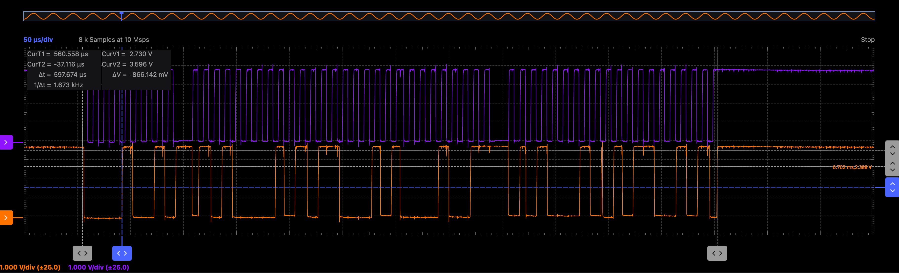

I2C communication with the ø32:
  1. transmit command byte (control modes, whether you are requesting data)
  2. transmit command data byte (target speed, or what data to request)
  3. receive 2 bytes of data response

Example in Arduino IDE:
```
int address = 9;                //example ø32 address
Wire.beginTransmission(address);
Wire.write(0xA1);               //example command
Wire.write(0xB1);               //example data
Wire.endTransmission(false);    //don't send a stop bit yet
Wire.requestFrom(9, 2);         //request 2 bytes

while(Wire.available()) {
    char c = Wire.read();   
    Serial.print(c, HEX);       // print the response
}
```